# Trading Data Pipeline Architecture

This document maps the full `modules/data-pipeline` area, including source files, tests, configuration, sample/runtime artifacts, package metadata, and transient cache files.

## Execution And Dependency Diagram

```mermaid
flowchart TD
  subgraph Package["src/trading_data_pipeline"]
    init["__init__.py
    Public re-exports"]
    cfg["config.py
    JSON + watchlist loaders"]
    dl["downloader.py
    Polygon downloader + CSV writer"]
    cli["cli.py
    trading-data-download"]
    bqs["bigquery_sync.py
    trading-data-sync"]
    bqp["bigquery_pull.py
    trading-data-pull"]
    cmc["coinmarketcap_downloader.py
    trading-data-download-cmc"]
    viz["visualize.py
    trading-data-visualize"]
    compat["fisher_adaptive_macd.py
    Compatibility re-export"]
    strat["strategies/fisher_adaptive_macd.py
    trading-data-fisher-adaptive"]
    metrics["strategy_metrics.py
    Trade/statistics helpers"]
  end

  subgraph Config["config/"]
    download_json["download.json"]
    nasdaq_csv["watchlists/NASDAQ.csv"]
    debug_csv["watchlists/debug.csv"]
  end

  subgraph Data["data/"]
    d1440["1440/AAL-1440M.csv
    1440/AAPL-1440M.csv
    1440/MU-1440M.csv"]
    d60["60/MU-60M.csv"]
    d15["15/MU-15M.csv"]
    postproc["1440/post_process.sh"]
    ds_data[".DS_Store files"]
  end

  subgraph Logs["logs/"]
    log_download["data_download.txt"]
    log_pull["data_pull_gcp.txt"]
    log_sync["data_sync.txt"]
  end

  subgraph Tests["tests/"]
    conftest["conftest.py"]
    t_init["__init__.py"]
    t_cli["test_cli.py"]
    t_bqp["test_bigquery_pull.py"]
    t_cmc["test_coinmarketcap_downloader.py"]
    t_shell["test_download_data_sh.py"]
    t_strat["test_fisher_adaptive_macd.py"]
    t_viz["test_visualize.py"]
    test_cache["tests/__pycache__/*.pyc"]
  end

  subgraph Packaging["Packaging + metadata"]
    readme["README.md"]
    pyproject["pyproject.toml"]
    egg["src/trading_data_pipeline.egg-info/
    PKG-INFO
    SOURCES.txt
    dependency_links.txt
    entry_points.txt
    requires.txt
    top_level.txt"]
    pytest_cache[".pytest_cache/
    .gitignore
    CACHEDIR.TAG
    README.md
    v/cache/lastfailed
    v/cache/nodeids"]
    ds_root[".DS_Store"]
    pyc_pkg["src/trading_data_pipeline/__pycache__/*.pyc"]
    pyc_strat["src/trading_data_pipeline/strategies/__pycache__/*.pyc"]
  end

  cli --> cfg
  cli --> dl
  bqs --> dl
  bqp --> dl
  cmc --> dl
  strat --> viz
  strat --> metrics
  compat --> strat
  init --> cfg
  init --> dl
  init --> strat
  init --> metrics
  viz --> strat

  cfg --> download_json
  cfg --> nasdaq_csv
  cli --> debug_csv
  dl --> d1440
  dl --> d60
  dl --> d15
  bqs --> d1440
  bqs --> d60
  bqs --> d15
  bqp --> d1440
  bqp --> d60
  bqp --> d15
  cmc --> Data
  viz --> d1440
  viz --> d60
  viz --> d15
  strat --> d1440
  strat --> d60
  strat --> d15

  t_cli --> cli
  t_cli --> cfg
  t_bqp --> bqp
  t_cmc --> cmc
  t_shell --> log_download
  t_strat --> compat
  t_viz --> viz
  conftest --> t_cli
  conftest --> t_bqp
  conftest --> t_cmc

  pyproject --> cli
  pyproject --> bqs
  pyproject --> bqp
  pyproject --> viz
  pyproject --> cmc
  pyproject --> strat
  readme --> cli
  readme --> bqs
  readme --> bqp
  readme --> viz
  readme --> cmc
  readme --> strat
```

## File Inventory

### Top level

- `README.md`: package overview, CLI commands, and Python reuse examples.
- `pyproject.toml`: setuptools build config, dependencies, pytest config, and CLI entry points.
- `.DS_Store`: macOS Finder metadata.
- `.pytest_cache/.gitignore`: pytest cache bookkeeping.
- `.pytest_cache/CACHEDIR.TAG`: pytest cache marker.
- `.pytest_cache/README.md`: pytest cache description.
- `.pytest_cache/v/cache/lastfailed`: pytest failure cache.
- `.pytest_cache/v/cache/nodeids`: pytest node id cache.

### Configuration

- `config/download.json`: default `minimum_market_cap` and `limit` values consumed by `config.py`.
- `config/watchlists/NASDAQ.csv`: default watchlist consumed by `config.py` and `cli.py`.
- `config/watchlists/debug.csv`: alternate watchlist used by `download_data.sh` tests and manual runs.

### Source package

- `src/trading_data_pipeline/__init__.py`: package export surface; re-exports config, downloader, strategy, and metrics APIs.
- `src/trading_data_pipeline/bigquery_pull.py`: BigQuery-to-CSV pull CLI.
- `src/trading_data_pipeline/bigquery_sync.py`: CSV-to-BigQuery upload CLI.
- `src/trading_data_pipeline/cli.py`: Polygon historical download CLI.
- `src/trading_data_pipeline/coinmarketcap_downloader.py`: CoinMarketCap crypto OHLCV download CLI.
- `src/trading_data_pipeline/config.py`: config and watchlist readers.
- `src/trading_data_pipeline/downloader.py`: Polygon REST client wrapper, market-cap filter, CSV archive writer.
- `src/trading_data_pipeline/fisher_adaptive_macd.py`: compatibility shim that re-exports the strategy module.
- `src/trading_data_pipeline/strategy_metrics.py`: completed trade model and performance metric calculations.
- `src/trading_data_pipeline/visualize.py`: local archive visualizer, HTML builder, strategy discovery/overlay integration.
- `src/trading_data_pipeline/strategies/fisher_adaptive_macd.py`: strategy engine, event detection, trade generation, chart payload builder, CLI entry point.

### Packaging metadata

- `src/trading_data_pipeline.egg-info/PKG-INFO`: built package metadata snapshot.
- `src/trading_data_pipeline.egg-info/SOURCES.txt`: package source manifest.
- `src/trading_data_pipeline.egg-info/dependency_links.txt`: dependency link metadata.
- `src/trading_data_pipeline.egg-info/entry_points.txt`: generated console-script entry points.
- `src/trading_data_pipeline.egg-info/requires.txt`: generated dependency list.
- `src/trading_data_pipeline.egg-info/top_level.txt`: top-level import package list.

### Runtime data and helper script

- `data/1440/AAL-1440M.csv`: archived daily bars.
- `data/1440/AAPL-1440M.csv`: archived daily bars.
- `data/1440/MU-1440M.csv`: archived daily bars.
- `data/1440/post_process.sh`: post-processing helper colocated with daily archive data.
- `data/60/MU-60M.csv`: archived 60-minute bars.
- `data/15/MU-15M.csv`: archived 15-minute bars.
- `data/.DS_Store`: macOS Finder metadata.
- `data/1440/.DS_Store`: macOS Finder metadata.

### Logs

- `logs/data_download.txt`: shell/CLI download log output.
- `logs/data_pull_gcp.txt`: BigQuery pull log output.
- `logs/data_sync.txt`: BigQuery sync log output.

### Tests

- `tests/__init__.py`: test package marker.
- `tests/conftest.py`: shared fixtures and Polygon env isolation.
- `tests/test_bigquery_pull.py`: parser and BigQuery pull behavior tests.
- `tests/test_cli.py`: download CLI and watchlist behavior tests.
- `tests/test_coinmarketcap_downloader.py`: CoinMarketCap parsing, fetch, CSV writing, and CLI tests.
- `tests/test_download_data_sh.py`: repo-level `download_data.sh` behavior tests against this module.
- `tests/test_fisher_adaptive_macd.py`: strategy computation and payload-shape tests.
- `tests/test_visualize.py`: timeframe parsing, archive lookup, and HTML render tests.

### Compiled/transient artifacts

- `src/trading_data_pipeline/__pycache__/__init__.cpython-312.pyc`
- `src/trading_data_pipeline/__pycache__/__init__.cpython-314.pyc`
- `src/trading_data_pipeline/__pycache__/bigquery_pull.cpython-312.pyc`
- `src/trading_data_pipeline/__pycache__/bigquery_pull.cpython-314.pyc`
- `src/trading_data_pipeline/__pycache__/bigquery_sync.cpython-312.pyc`
- `src/trading_data_pipeline/__pycache__/bigquery_sync.cpython-314.pyc`
- `src/trading_data_pipeline/__pycache__/cli.cpython-312.pyc`
- `src/trading_data_pipeline/__pycache__/cli.cpython-314.pyc`
- `src/trading_data_pipeline/__pycache__/coinmarketcap_downloader.cpython-312.pyc`
- `src/trading_data_pipeline/__pycache__/coinmarketcap_downloader.cpython-314.pyc`
- `src/trading_data_pipeline/__pycache__/config.cpython-312.pyc`
- `src/trading_data_pipeline/__pycache__/config.cpython-314.pyc`
- `src/trading_data_pipeline/__pycache__/downloader.cpython-312.pyc`
- `src/trading_data_pipeline/__pycache__/downloader.cpython-314.pyc`
- `src/trading_data_pipeline/__pycache__/fisher_adaptive_macd.cpython-312.pyc`
- `src/trading_data_pipeline/__pycache__/fisher_adaptive_macd.cpython-314.pyc`
- `src/trading_data_pipeline/__pycache__/strategy_metrics.cpython-312.pyc`
- `src/trading_data_pipeline/__pycache__/strategy_metrics.cpython-314.pyc`
- `src/trading_data_pipeline/__pycache__/visualize.cpython-312.pyc`
- `src/trading_data_pipeline/__pycache__/visualize.cpython-314.pyc`
- `src/trading_data_pipeline/strategies/__pycache__/fisher_adaptive_macd.cpython-312.pyc`
- `src/trading_data_pipeline/strategies/__pycache__/fisher_adaptive_macd.cpython-314.pyc`
- `tests/__pycache__/__init__.cpython-312.pyc`
- `tests/__pycache__/conftest.cpython-312-pytest-9.0.2.pyc`
- `tests/__pycache__/test_bigquery_pull.cpython-312-pytest-9.0.2.pyc`
- `tests/__pycache__/test_cli.cpython-312-pytest-9.0.2.pyc`
- `tests/__pycache__/test_coinmarketcap_downloader.cpython-312-pytest-9.0.2.pyc`
- `tests/__pycache__/test_download_data_sh.cpython-312-pytest-9.0.2.pyc`
- `tests/__pycache__/test_fisher_adaptive_macd.cpython-312-pytest-9.0.2.pyc`
- `tests/__pycache__/test_fisher_adaptive_macd.cpython-314.pyc`
- `tests/__pycache__/test_visualize.cpython-312-pytest-9.0.2.pyc`
- `tests/__pycache__/test_visualize.cpython-314.pyc`

## Key Runtime Paths

- `trading-data-download` -> `cli.py` -> `config.py` + `downloader.py` -> `data/<interval>/*.csv`
- `trading-data-sync` -> `bigquery_sync.py` -> `data/<timeframe>/*.csv` -> BigQuery
- `trading-data-pull` -> `bigquery_pull.py` -> BigQuery -> `data/<timeframe>/*.csv`
- `trading-data-download-cmc` -> `coinmarketcap_downloader.py` -> CoinMarketCap API -> `data/cmc/<timeframe>/*.csv`
- `trading-data-visualize` -> `visualize.py` -> archived CSVs -> HTML + browser view
- `trading-data-fisher-adaptive` -> `strategies/fisher_adaptive_macd.py` -> `visualize.py` loaders + `strategy_metrics.py` -> JSON/chart payload

## Notes

- `visualize.py` dynamically discovers strategy modules under `src/trading_data_pipeline/strategies/`.
- `fisher_adaptive_macd.py` at the package root exists only as a compatibility import alias.
- The repo-level script `Trading-Backtester/download_data.sh` is outside this directory, but it is an operational entry point into `trading-data-download` and is covered by `tests/test_download_data_sh.py`.
